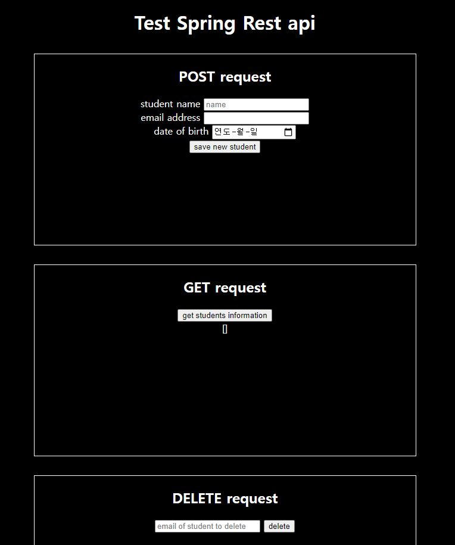

# Spring Boot rest api demo
[amigoscode의 영상](https://youtu.be/9SGDpanrc8U), _Spring in action_ 을 참고하여 
만들어본 spring web application.  

루트페이지에서 `POST`, `GET`, `DELETE` request를 시험해 볼 수 있다.  
post요청시 필요한 데이터를 검사하는 기능은 만들지 않음.  
jar파일로 패키징해 바로 실행가능.

## 알게된것?
* `@RestController`와 `@Controller`의 차이 - rest는 json등 데이터로 반환하고,
controller는 view경로를 반환하는것으로 예상한다.
* 메소드에 `@Query`를 이용해 DML을 사용할려면 `@Transactional`과 `@Modifying`을 붙여줘야한다. 

* `json`요청을 controller에서 POJO 객체로 받으려할때 해당 클래스의 빈 생성자를 사용할 수 있어야한다. 
자세한 내용은 [stackoverflow](https://stackoverflow.com/questions/53191468/no-creators-like-default-construct-exist-cannot-deserialize-from-object-valu)에 나와있는데 대충 
json을 객체로 매핑시키는 과정에서 `@JsonProperty("field_name")`과 같이 필드에 매핑시키는 방법을 지정하지않으면 
빈 생성자로 객체를 만들고 json의 필드이름으로 매핑시키는듯 하다.  

* application.properties에서 hibernate설정 방법, JSP설정방법. 이는 해당 파일 확인.